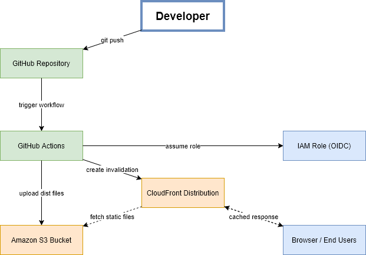

# Mid Lab - React Deployment with Terraform and GitHub Actions

This project deploys a React marketing website to AWS using Terraform and GitHub Actions.

Website URL: https://d2pzalk0p2lnso.cloudfront.net

## Project Overview

The goal of this project is to build a production-like deployment flow for a React application.

The infrastructure is managed with Terraform, and the deployment process is automated with GitHub Actions.
Every push to the main branch builds the React app, uploads the production files to Amazon S3, and invalidates the CloudFront cache.

## Architecture

The full Draw.io source file is included in this repository:

- architecture.drawio

## AWS Components

### Amazon S3

S3 stores the static build files created from the React application.

### S3 Bucket Versioning

Versioning is enabled on the bucket so object changes can be tracked.

### S3 Public Access Block

The bucket is not public. Public access is blocked.

### CloudFront

CloudFront serves the website globally and improves performance by caching the static files.

### Origin Access Control

CloudFront uses Origin Access Control to access the private S3 bucket securely.

### IAM Role with OIDC

GitHub Actions authenticates to AWS using OIDC and assumes an IAM role.
No AWS access keys are stored in GitHub.

## CI/CD Flow

1. Developer pushes code to main.
2. GitHub Actions starts automatically.
3. The workflow installs Node.js and project dependencies.
4. The React application is built.
5. GitHub Actions authenticates to AWS using OIDC.
6. The build output is uploaded to S3.
7. CloudFront cache is invalidated.

## Repository Structure

- app/ - React application
- terraform/ - Terraform infrastructure code
- .github/workflows/ - GitHub Actions workflow
- images/ - screenshots and architecture image
- architecture.drawio - manual architecture diagram
- README.md - project documentation

## Terraform

Main resources:

- S3 bucket
- S3 versioning
- S3 public access block
- S3 bucket policy
- CloudFront distribution
- CloudFront Origin Access Control
- IAM OIDC provider
- IAM role for GitHub Actions

Useful commands:

- terraform -chdir=terraform init
- terraform -chdir=terraform validate
- terraform -chdir=terraform plan
- terraform -chdir=terraform apply

## GitHub Actions

Workflow file:

- .github/workflows/deploy.yml

The workflow runs on every push to main.

Repository variables used by the workflow:

- AWS_REGION
- S3_BUCKET
- CLOUDFRONT_DISTRIBUTION_ID
- AWS_ROLE_ARN

## Validation

Successful deployment evidence:

Website through CloudFront:

CloudFront URL:

- https://d2pzalk0p2lnso.cloudfront.net

## Notes

This project was created as a mid-lab assignment for the DevOps course.
The focus is Terraform infrastructure, AWS static hosting, CloudFront delivery, and CI/CD with GitHub Actions OIDC.
